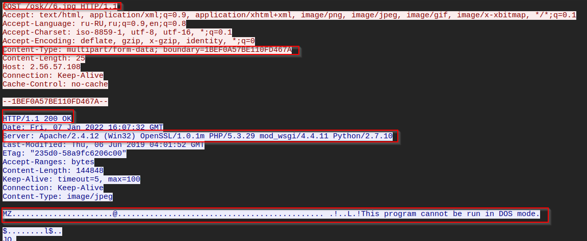
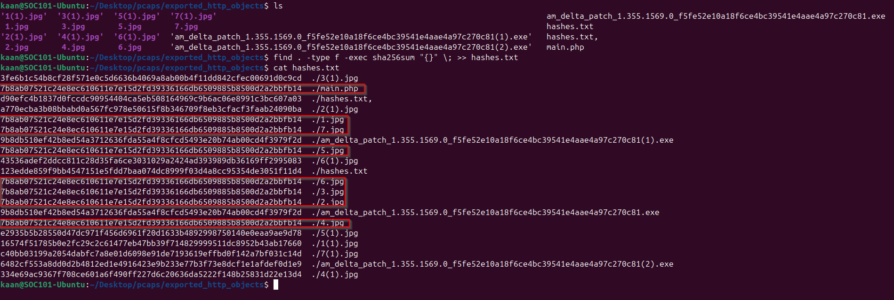

# Analysis Notes

## Initial DNS Observations

- The infected host (`192.168.1.216`) made several suspicious DNS A queries.
- All queries were directed to the local DNS server (`192.168.1.2`).
- Repeated attempts to resolve the following domains:

  - `spoonwatch-dc.spoonwatch.net`
  - `wpad.spoonwatch.net`
  - `wpad.localdomain`
  - `spoonwatch.net`

- The use of `wpad.` domains may suggest WPAD-based abuse or misconfigured name resolution.
- The domains are not commonly seen in benign enterprise networks and may be used as part of the malware’s command-and-control (C2) infrastructure or lateral movement.
- We used the following display filter in Wireshark to extract these queries:
  dns.qry.type == 1 && dns.flags.response == 0

- Below is a screenshot showing the suspicious DNS A queries initiated by the infected host:


## HTTP POST Payload Analysis

- Several HTTP POST requests were made by the infected host to `2.56.57.108` targeting the `/osk/` directory.
- Despite the `.jpg` extension in filenames like `6.jpg`, the payloads contain executable headers (`MZ`), indicating PE (Windows executable) files.
- This is a common masquerading tactic used in malware delivery, aligning with MITRE ATT&CK technique **T1036.003 - Masquerading: Rename System Utilities**.
- The content type used was `multipart/form-data`, typically used for file uploads.

### 🔍 Screenshot – Suspicious POST to /osk/6.jpg


## HTTP POST Traffic Observations

- Multiple HTTP POST requests observed from the infected host (`192.168.1.216`) to external IP `2.56.57.108`.
- All requests target the `/osk/` directory on the destination server.
- Payloads use `.jpg` extensions, possibly to disguise data exfiltration.
- Final request to `/main.php` suggests possible C2 communication or further stage.
  

## Malicious Payloads Observed

Although the `.exe` files extracted from the PCAP were not flagged, multiple `.jpg` files and `main.php` uploaded by the infected host were identified as malware.

- These files shared the same hash:
  - `7b8ab07521c24e8ec610611e7e15d2fd39336166db6509885b8500d2a2bbfb14`
- Detected as: `Win.Malware.Agent-7761700-0`
- Indicates likely obfuscation or masquerading tactics (e.g., image or PHP file used to deliver a payload)



## MITRE ATT&CK Mapping

The behavior observed maps to the following MITRE ATT&CK technique:

- **T1036.003 – Masquerading: Rename System Utilities**  
  Several `.jpg` files and a `main.php` file shared the exact same hash and were flagged by VirusTotal as malware. This strongly suggests the use of file masquerading techniques to disguise a malicious payload as a harmless file type.

Such tactics are used to bypass user suspicion and evade simple file extension-based filters.

## Snort Detection Rules

To detect possible Trickbot C2 communication based on our PCAP analysis, we wrote two custom Snort rules:

### Rule 1 – POST Request to `/osk/` Directory on Malicious IP

```snort
alert tcp $HOME_NET any -> 2.56.57.108 80 (msg:"[Trickbot] Possible C2 Communication to known malicious IP"; flow:established,to_server; content:"POST"; http_method; content:"/osk/"; http_uri; sid:100001; rev:1;)
This rule detects HTTP POST requests from an internal host to the /osk/ path on the suspicious IP 2.56.57.108.

### Rule 2 – POST to /main.php Endpoint

alert tcp $HOME_NET any -> 2.56.57.108 80 (msg:"[Trickbot] Possible POST to C2 Command Endpoint (/main.php)"; flow:established,to_server; content:"POST"; http_method; content:"/main.php"; http_uri; sid:100002; rev:1;)
This rule detects POST traffic directed to main.php, which we suspect to be a command-and-control endpoint.

### Rule Deployment and Testing
We created a file named trickbot.rules and added it to Snort’s configuration with this line in snort.conf:
include $RULE_PATH/trickbot.rules
Snort was successfully started with the new rules.


