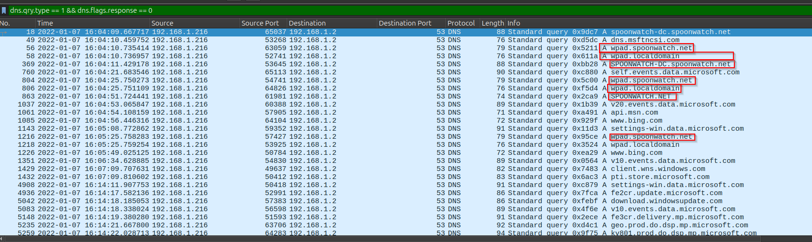
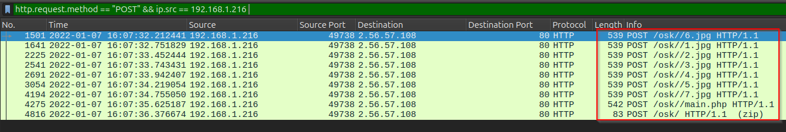
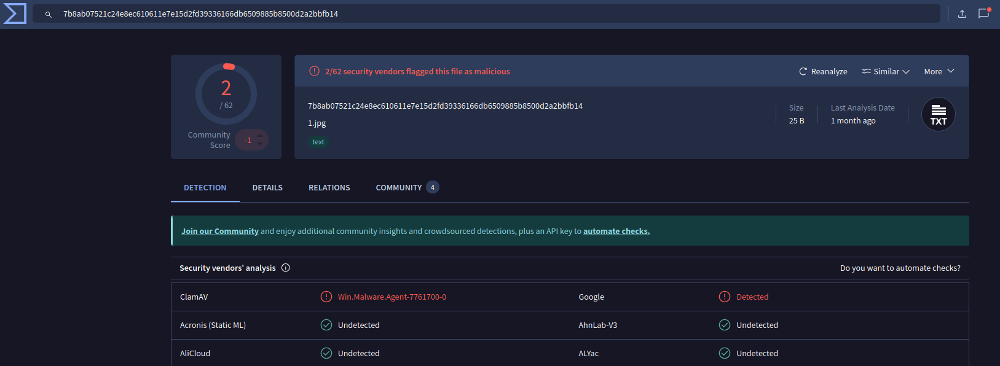

# Analysis Notes

## Initial DNS Observations

- The infected host (`192.168.1.216`) made several suspicious DNS A queries.
- All queries were directed to the local DNS server (`192.168.1.2`).
- Repeated attempts to resolve the following domains:

  - `spoonwatch-dc.spoonwatch.net`
  - `wpad.spoonwatch.net`
  - `wpad.localdomain`
  - `spoonwatch.net`

- The use of `wpad.` domains may suggest WPAD-based abuse or misconfigured name resolution.
- The domains are not commonly seen in benign enterprise networks and may be used as part of the malware’s command-and-control (C2) infrastructure or lateral movement.
- We used the following display filter in Wireshark to extract these queries:
  dns.qry.type == 1 && dns.flags.response == 0

- Below is a screenshot showing the suspicious DNS A queries initiated by the infected host:

## HTTP POST Traffic Observations

- Multiple HTTP POST requests observed from the infected host (`192.168.1.216`) to external IP `2.56.57.108`.
- All requests target the `/osk/` directory on the destination server.
- Payloads use `.jpg` extensions, possibly to disguise data exfiltration.
- Final request to `/main.php` suggests possible C2 communication or further stage.
  

## Malicious Payloads Observed

Although the `.exe` files extracted from the PCAP were not flagged, multiple `.jpg` files and `main.php` uploaded by the infected host were identified as malware.

- These files shared the same hash:
  - `7b8ab07521c24e8ec610611e7e15d2fd39336166db6509885b8500d2a2bbfb14`
- Detected as: `Win.Malware.Agent-7761700-0`
- Indicates likely obfuscation or masquerading tactics (e.g., image or PHP file used to deliver a payload)

